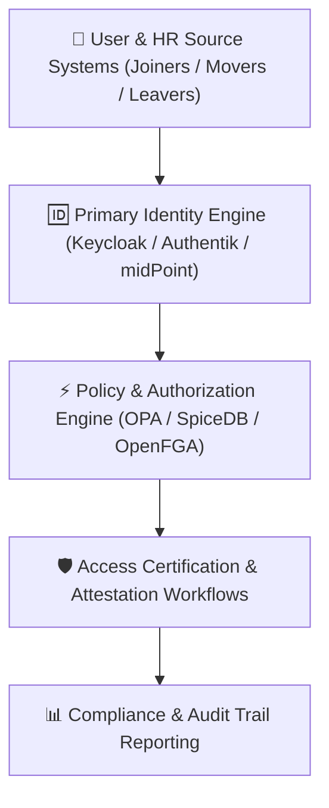
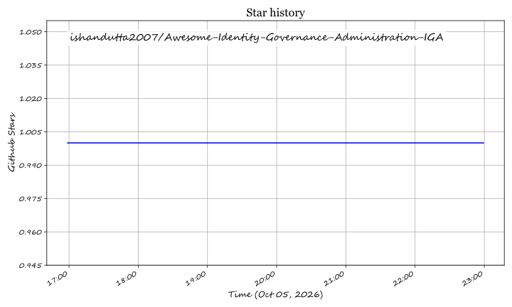

# 🛡️ Awesome Identity Governance & Administration (IGA) 🔐

  
  
  
  
  

## 🚀 Overview & Ecosystem Guide

Welcome to the **Awesome Identity Governance & Administration (IGA)** resource list! Identity Governance & Administration forms the critical backbone of enterprise cybersecurity, identity lifecycle management, compliance enforcement, and access reviews.

This curated index provides security architects, identity engineers, and CISOs with a comprehensive benchmark of leading commercial **SaaS Platforms** and **Open-Source IAM / IGA Frameworks**.

---

## 📊 Market Overview & Industry Dynamics

> 💡 **Market Size & Structure**: As of 2026, the global Identity Governance & Administration (IGA) market is valued at **~$9.5 Billion – $10.1 Billion**, growing at a CAGR of ~13.5% toward $20+ Billion over the next decade. 
> 
> 🧩 **Market Fragmentation**: The IGA sector is **moderately-to-highly fragmented**. It features legacy enterprise titans (SailPoint, Oracle, IBM, Microsoft), cloud-native scale-ups (Saviynt, ConductorOne, Omada), and specialized open-source policy/identity frameworks (Keycloak, Authentik, OPA, SpiceDB). While consolidation (M&A and unified identity security platforms) is accelerating, diverse enterprise compliance requirements and identity sprawl (especially AI and machine identities) keep the market dynamic and fragmented rather than "winner-take-all".

---

## 🏢 SaaS & Enterprise Hosted Platforms

The table below lists key enterprise IGA SaaS vendors, sorted in **descending order** by company scale (Revenue / Valuation).

| Platform 🌐 | Starting Tier Price 💰 | Free Tier / Trial Limits ⏳ | Company Size (Revenue / Valuation) 📈 | Key Governance Capabilities & Use Cases ⚙️ |
| :--- | :--- | :--- | :--- | :--- |
| **[Microsoft Entra ID Governance](https://www.microsoft.com/en-us/security/business/identity-access/microsoft-entra-id-governance)** | $7.00 per user/month (Requires Entra ID P1/P2 base license) | 30-day free trial (up to 100 trial user licenses) | ~$75.0 Billion+ (Security Division ARR / $3.1T Microsoft Corp) | Native Entitlement Management, Access Reviews, Lifecycle Workflows & Privileged Identity Management (PIM). |
| **[SailPoint Identity Security Cloud / IdentityIQ](https://www.sailpoint.com/)** | ~$15.00 per user/month ($180/user/year starting enterprise quote) | 30-day customized enterprise proof-of-concept (POC) sandbox | $1.23 Billion ARR (Nasdaq: SAIL) | AI-driven access certifications, role mining, segregation-of-duties (SoD) policies, and 500+ deep enterprise connectors. |
| **[IBM Security Verify Governance](https://www.ibm.com/products/verify-governance)** | ~$6.50 per user/month ($78/user/year base enterprise tier) | 30-day evaluation trial upon enterprise request | ~$500 Million (Verify Security Business / $62B IBM Corp) | Comprehensive access risk analysis, role management, certification campaigns, and mainframe/legacy integration. |
| **[Oracle Identity Governance](https://www.oracle.com/security/identity-management/)** | ~$8.00 per user/month (Oracle Cloud IAM & Governance suite) | 30-day Free Trial with $300 Oracle Cloud credits | ~$450 Million (Identity Suite / $53B Oracle Corp) | Enterprise role lifecycle management, analytics-driven access requests, and deep Oracle ERP/EBS integration. |
| **[One Identity Manager](https://www.oneidentity.com/products/identity-manager/)** | ~$5.00 per user/month ($60/user/year enterprise starting license) | 30-day free evaluation trial (Self-hosted or hosted POC) | ~$350 Million Revenue | Governance-led lifecycle management, fine-grained access control, and attestation workflows. |
| **[Saviynt Enterprise Identity Cloud](https://saviynt.com/)** | ~$12.00 per user/month (Standard SaaS user tier quote) | 14-day dedicated trial sandbox upon sales request | $300 Million+ ARR ($3.0 Billion Valuation) | Cloud-native converged identity platform, cross-application SoD analysis, and fine-grained application governance. |
| **[ConductorOne (C1)](https://www.conductorone.com/)** | ~$3.50 per identity/month (~$4,300/year base tier for 100 identities) | 14-day guided proof-of-concept (POC) deployment | ~$25 Million Revenue ($350 Million Valuation) | Modern continuous access reviews, just-in-time (JIT) access requests, Slack/Teams workflows, and AI identity governance. |
| **[Omada Identity Cloud](https://www.omadaidentity.com/)** | ~$4.50 per user/month ($54/user/year enterprise starting price) | 30-day structured proof-of-value (POV) trial sandbox | ~$45 Million Revenue | Process-oriented identity governance, standard workflow templates, and out-of-the-box compliance reporting. |
| **[ClearSkies IGA](https://www.clearskies.com/)** | ~$3.00 per user/month (Managed IGA service base tier) | 14-day evaluation demo instance | ~$15 Million Revenue | Threat-informed identity governance, compliance audit tracking, and automated access attestation. |
| **[Simeio Identity Platform](https://www.simeio.com/)** | ~$4.00 per user/month (Managed Identity & Governance service) | 30-day guided evaluation environment | ~$80 Million Revenue | Managed identity governance services, multi-tenant IGA orchestration, and access certification management. |

---

## 🔓 Open-Source GitHub Projects & Identity Engines

Full-featured enterprise IGA (access certification campaigns, complex SoD engines, and hundreds of out-of-the-box connectors) is heavily dominated by commercial platforms. However, powerful open-source IAM, authorization engines, and governance components exist.

The open-source options below are sorted in **descending order** by GitHub Stars_Counts:

| Project 📦 | Stars_Count Badge 🌟 | Category / Focus 🎯 | Key Capabilities & Description 📝 |
| :--- | :--- | :--- | :--- |
| **[Keycloak](https://github.com/keycloak/keycloak)** |  | Open-Source IAM Platform | Industry-standard open-source identity and access management; handles user federation, fine-grained authorization policies, and SSO. |
| **[Authentik](https://github.com/goauthentik/authentik)** |  | Modern IdP & Governance Stack | Open-source identity provider focused on flexibility, custom Python policy engine, self-service user portal, and RBAC/ABAC enforcement. |
| **[Ory Kratos](https://github.com/ory/kratos)** |  | Cloud-Native Identity Management | API-first user management, identity schema enforcement, multi-factor authentication, and headless lifecycle management. |
| **[Open Policy Agent (OPA)](https://github.com/open-policy-agent/opa)** |  | General-Purpose Policy Engine | CNCF graduated policy engine using Rego to enforce unified authorization, Segregation of Duties (SoD), and compliance guardrails. |
| **[SpiceDB](https://github.com/authzed/spicedb)** |  | Fine-Grained Authorization (ReBAC) | Google Zanzibar-inspired open-source database for relationship-based access control (ReBAC) and enterprise entitlement tracking. |
| **[OpenFGA](https://github.com/openfga/openfga)** |  | High-Performance Authorization | CNCF project created by Auth0/Okta for relationship-based access control (ReBAC) and fine-grained entitlement queries at scale. |
| **[Kanidm](https://github.com/kanidm/kanidm)** |  | Identity & Access Management | Rust-based identity management system engineered for high performance, strong security defaults, and modern OAuth2/OIDC governance. |
| **[Ory Keto](https://github.com/ory/keto)** |  | Access Control Server | Open-source implementation of Google Zanzibar; provides low-latency access control checks and permission graph evaluation. |
| **[OPA Gatekeeper](https://github.com/open-policy-agent/gatekeeper)** |  | Policy Governance for Kubernetes | Policy controller for Kubernetes to enforce compliance, security constraints, and identity governance on cloud-native workloads. |
| **[Janssen Project (Jans)](https://github.com/JanssenProject/jans)** |  | Linux Foundation Identity Platform | High-performance open-source digital identity platform built by the Gluu community for federated identity, FIDO2, and access control. |
| **[Evolveum midPoint](https://github.com/Evolveum/midpoint)** |  | Full Open-Source IGA System | Dedicated open-source Identity Governance & Administration platform supporting user provisioning, organizational structure, access request workflows, and role management. |
| **[Gluu oxTrust](https://github.com/GluuFederation/oxTrust)** |  | Admin UI & Identity Management | Management interface for the Gluu Server to govern identities, OAuth clients, and authentication policies. |

---

## 🛠️ Open-Source Governance Architectures & Frameworks

Organizations building custom IGA pipelines can combine these open-source building blocks:

1. **Identity Provider & Provisioning Hub**: Use **midPoint** or **Keycloak / Authentik** for core lifecycle management (Joiner-Mover-Leaver automation).
2. **Entitlement & Policy Engine**: Integrate **OPA (Open Policy Agent)** or **SpiceDB / OpenFGA** for fine-grained relationship access control (ReBAC/ABAC) and Segregation of Duties (SoD) enforcement.
3. **Certification & Audit Logging**: Store identity event logs in centralized SIEM/Audit warehouses for compliance verification (SOC2, GDPR, ISO27001).

---

## 🤝 How to Contribute

We welcome community contributions! To add a new platform or update existing details:

1. Fork this repository.
2. Edit `README.md` following the tabular format and guidelines above.
3. Ensure factual descriptions, official links, transparent pricing notes, and Stars_Counts.
4. Open a Pull Request (PR) with a short description of your changes.

---

## 💖 Support & Community

Thank you for exploring and using this repository! If you find this resource helpful for your identity governance research or enterprise architecture:

- 🌟 **Star this repository** to show your appreciation and help others discover it.
- 🔀 **Fork it** and submit pull requests to share new platforms or updates.
- 📢 **Share** this list with fellow security architects, IAM engineers, and security teams.
- ☕ **Sponsor / Buy me a coffee**: If you'd like to support the ongoing maintenance of this awesome list, consider sponsoring via the [GitHub Sponsor Dashboard](https://github.com/sponsors/ishandutta2007).

---

## 📜 Disclaimer

*This list is community-curated for informational and research purposes only. Identity Governance directly impacts organizational security posture and regulatory compliance. Always conduct formal procurement evaluations and vendor security assessments.*

---

## 📈 Star History

---

  <b>Made with ❤️ for Identity Architects, Security Engineers, and Open Identity Advocates.</b>

## ⭐ Star History

<a href="https://star-history.com/#ishandutta2007/Awesome-Identity-Governance-Administration-IGA&Timeline" align="center">
  <picture>
    <source media="(prefers-color-scheme: dark)" srcset="assets/ishandutta2007_Awesome-Identity-Governance-Administration-IGA_growth.svg">
    
  </picture>
</a>
